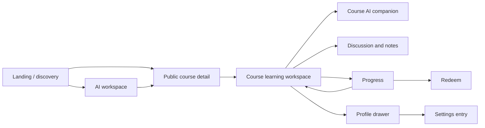

# MOOCKY Product Design Handoff

> Status: implementation-facing summary generated for the portfolio workflow.  
> Authority: this file is subordinate to [`docs/design-system.md`](./docs/design-system.md), [`docs/component-specs.md`](./docs/component-specs.md), and [`tokens.json`](./tokens.json). If any rule conflicts, those sources win.

## 1. Product Intent

MOOCKY is an AI-enhanced online learning platform for independent, efficiency-oriented learners. AI is embedded into discovery, course learning, review, and path planning. It must remain contextual, user-controlled, calm, and supportive.

Design opportunity:

> Bring familiar AI interactions into online courses so learners receive timely, course-aware support without forced social interaction or disruptive automation.

## 2. Experience Architecture



## 3. Production Routes

| Route | Role | Primary hierarchy |
| --- | --- | --- |
| `/` | Marketing and discovery | Brand entry → AI intent → courses → domains |
| `/courses/[course]` | Public course evaluation | Course value → outcomes → curriculum → instructor/reviews → CTA |
| `/course` | Authenticated learning shell | Lesson media → curriculum/context → AI support |
| `/ai` | AI-first workspace | Conversation → reasoning status → answer → follow-ups/cards |
| `/my-progress` | Learner dashboard | Metrics → active courses → AI insights |
| `/redeem` | Rewards utility | Balance/context → rewards catalog |
| `/settings` | Account utility entry | Preferences handoff → return to learner workspace |

Legacy prototype routes may redirect to product routes but must not host duplicate production implementations.

## 4. Visual Direction

MOOCKY is **warm, restrained, editorial, and product-usable**.

- Use editorial expression for page-defining titles, brand statements, and identity moments.
- Use quiet utility typography and compact density inside task-heavy learning and AI interfaces.
- Build hierarchy with spacing, typography, borders, and surface contrast before adding effects.
- Use no ambient shadows by default.
- Over complex media or gradient backgrounds, prefer translucent surfaces with `8px` backdrop blur.
- Use approved gradient image assets only; do not approximate brand gradients with ad hoc CSS.

## 5. Foundations

### 5.1 Brand

- Product brand: `MOOCKY`
- Design system: `Lumen Atlas`
- Canonical logo: fixed vector `LogoLockup`, `97px × 32px`
- Do not rebuild the logo with live typography or detach the sparkle.

### 5.2 Typography

| Role | Typeface | Rules |
| --- | --- | --- |
| Display first word | Cormorant Infant Medium Italic | `-4px` tracking; optical offset |
| Display remainder | Gayathri Thin | `-1px` tracking; size ≈ `0.85` of first word |
| Module/card title | DM Serif Text | Maximum `40px` |
| UI/body/control | Geist | Regular default; Semibold/Bold only for emphasis |

- Do not use the display pair below `42px`.
- Geist UI text stays within `12px–20px`.
- `DataPanelMetricValue` is the narrow exception: Geist Semibold `32px/40px`.

### 5.3 Color

Use semantic tokens from `tokens.json`.

- Light `bg.canvas`: warm off-white.
- Light `text.primary`: `#3E332E`.
- Dark `text.primary`: `#EDE8E1`.
- `surface.base`: default card/control surface.
- `border.soft` and `border.medium`: primary structure.
- `accent.brand`: single primary action/accent role.
- `text.aiAnswer`: scoped to light AI conversation reading text.

Do not create a cold neutral system or new accent family without updating the normative design-system source.

### 5.4 Geometry

- Regular radii: `16px`, `8px`, `pill`.
- Corner smoothing: `60%`.
- Default component stroke: `0.5px`.
- Default icon: Lucide, `16px`, `1.5px` stroke.
- Common padding tiers: `12px` elongated controls, `16px` cards/containers, `24px` larger modules.

### 5.5 Motion

- Default hover transition: `160ms ease-out`.
- Shared viewport reveal: opacity `0 → 1`, translateY `14px → 0`, `300ms ease-out`.
- Batch reveal stagger: `160ms`, capped at `320ms`.
- Respect reduced motion.
- Do not apply reveal to footers.

## 6. Layout Archetypes

### Marketing shell

- Spacious section rhythm.
- Editorial entry and controlled gradient imagery.
- Discovery modules before product chrome.

### Learning shell

- Utility header.
- Lesson/media first.
- Curriculum and contextual support remain secondary.
- Marketing hero patterns do not enter the study workspace.

### AI workspace

- Conversation content stays readable and centered.
- Expanded sidebar is `350px`; collapsed rail is `60px × 100px`.
- Desktop answer/composer body is currently trialed at `720px`.
- User question aligns right; AI answer aligns left with a `32px` marker.

## 7. Global Components

### Button

Use purpose-based kinds:

- `PrimaryAction`: the only brown filled action; maximum one per interface surface.
- `NeutralAction`: repeated filled actions.
- `AuxiliaryAction`
- `CardGuideAction`
- `NewsletterCompound`
- `FloatingResume`

Do not replace purpose names with generic `brand`, `surface`, or `ghost` variants.

### Tag

Global metadata/status/category component with `Default`, `Compact`, and `Line` densities. Tag is not a Button replacement.

### Text and DisplayTitle

- `Text` owns typography and semantic tone, not layout.
- Parent components own spacing, placement, and responsive behavior.
- `DisplayTitle` owns the strict two-font optical construction.

### LogoLockup

Fixed vector geometry; theme variants may recolor through `currentColor`.

### ViewportRevealRuntime

Mount once per page or shell. Page-local reveal keyframes are prohibited.

## 8. Scene Components

Important confirmed scene components include:

- `MarketingHeader`
- `LearningHeader`
- `HeroPromptField`
- `HeaderSearchField`
- `PopularCourseStrip`
- `RecommendedCourseCard`
- `CurriculumRail`
- `LessonMediaPanel`
- `DiscussionThread`
- `AICompanionRail`
- `AIAnswerBlock`
- `AIQuestionBubble`
- `AIThinkingIndicator`
- `AIAnswerActions`
- `CompactProductFooter`
- `ProfileDrawer`

Scene components become global only after repeated use and explicit promotion.

## 9. AI Interaction Contract

### 9.1 Shared states

`idle`, `promptSuggested`, `composerFocused`, `composing`, `sending`, `streaming`, `answered`, `error`, `emptyContext`.

### 9.2 Surfaces

- `courseRail`
- `heroPrompt`
- `headerSearch`
- `futureSurface`

### 9.3 Response envelope

```ts
type AiResponseEnvelope = {
  answerKind: "answer" | "refusal" | "clarification";
  surface: "courseRail" | "heroPrompt" | "headerSearch" | "futureSurface";
  conversationTitle: string;
  answerMarkdown: string;
  contextTags: Array<{
    type: "currentLesson" | "timestamp" | "courseTitle";
    label: string;
    value: string;
  }>;
  followUpChips: string[];
  courseRecommendationCards: Array<{
    id: string;
    title: string;
    description: string;
    provider: string;
    rating: string;
    reviews: string;
    href: string;
  }>;
};
```

### 9.4 Rendering

- Render `answerMarkdown` as rich content.
- Render tags, chips, and cards from dedicated fields.
- Streaming may expose `answer_delta` before the final validated envelope.
- Personalized Suggestion cards may arrive through application-composed `cards_ready`.
- Never parse Markdown to discover UI controls.

### 9.5 Reasoning and safety

- Hidden chain-of-thought must never appear in `answerMarkdown`.
- Provider `reasoning_content` may appear in a separate Thinking panel only.
- Do not invent course facts, transcript details, progress, or personal information.
- Refusal uses the normal answer pattern with a direct reason and useful alternative.

## 10. Server Integration

Endpoints:

- `POST /api/moocky-ai`
- `POST /api/moocky-ai/stream`
- `GET /api/moocky-ai/health`

Environment variables:

- `AI_PROVIDER`
- `OPENAI_API_KEY`
- `OPENAI_MODEL`
- `MOONSHOT_API_KEY`
- `MOONSHOT_MODEL`
- `MOONSHOT_THINKING_MODE`

Keys remain server-side. `docs/ai-system-prompt.md` must be included in the deployment package.

## 11. Responsive and Accessibility Acceptance

- Verify at `1440px`, `1024px`, and `390px`.
- Verify light and dark themes where supported.
- Check spacing, font size, color, alignment, radius, shadow, and responsive behavior.
- Check hover, focus-visible, loading, error, and empty states.
- Provide accessible names for icon-only actions.
- Respect reduced motion.
- Do not claim full parity without structured Figma evidence and browser screenshots.

## 12. Open Questions

- Exact breakpoint thresholds.
- Full mobile header and rail collapse behavior.
- Complete non-button state matrices.
- AI dark edge states and error taxonomy.
- Transcript-selected context behavior.
- Media captions and advanced playback accessibility.
- Whether public course purchase modules should become global product components.
- Stitch prototype evidence and its documented influence on the high-fidelity design.
